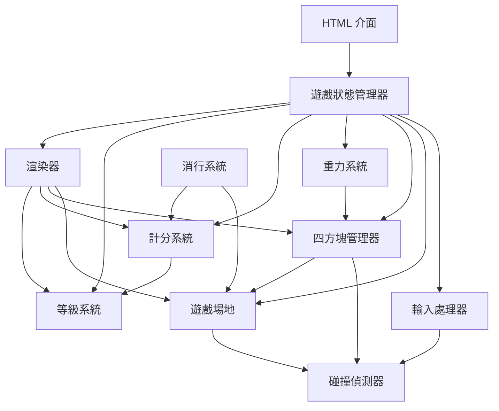

# 設計文件

## Overview

本設計文件描述瀏覽器俄羅斯方塊遊戲的技術實作方案。此遊戲使用單一 HTML 檔案實作，包含原生 JavaScript 與 CSS，不依賴任何外部套件。

遊戲核心包含以下主要系統：
- 遊戲場地管理：10×20 的二維陣列結構
- 四方塊系統：7 種標準四方塊類型及其旋轉邏輯
- 輸入處理：鍵盤事件監聽與操作映射
- 碰撞偵測：邊界與方塊碰撞檢查
- 重力系統：基於等級的自動下落機制
- 消行系統：填滿列的偵測與移除
- 計分與等級：分數累積與難度調整
- 渲染系統：Canvas 2D 繪圖

## Architecture

### 系統架構圖



### 模組職責

1. **Game State Manager（遊戲狀態管理器）**
   - 管理遊戲狀態：未開始、進行中、結束
   - 協調各子系統的初始化與更新
   - 處理遊戲循環

2. **Input Handler（輸入處理器）**
   - 監聽鍵盤事件
   - 將按鍵映射到遊戲操作
   - 在遊戲結束時停止接受輸入

3. **Game Field（遊戲場地）**
   - 維護 10×20 的二維陣列
   - 記錄已固定方塊的位置與顏色
   - 提供場地查詢與更新介面

4. **Tetromino Manager（四方塊管理器）**
   - 管理當前四方塊與下一個四方塊
   - 處理四方塊的移動、旋轉
   - 隨機生成新四方塊
   - 固定四方塊到場地

5. **Collision Detector（碰撞偵測器）**
   - 檢查四方塊與場地邊界的碰撞
   - 檢查四方塊與已固定方塊的碰撞
   - 驗證移動與旋轉的合法性

6. **Gravity System（重力系統）**
   - 基於等級計算下落間隔
   - 定期觸發四方塊下落
   - 在遊戲結束時停止

7. **Line Clear System（消行系統）**
   - 偵測填滿的列
   - 移除填滿的列
   - 將上方列向下移動

8. **Scoring System（計分系統）**
   - 計算消行分數（1/2/3/4 列）
   - 計算緩降與瞬降分數
   - 維護當前分數

9. **Level System（等級系統）**
   - 追蹤累計消除列數
   - 每 10 列提升一個等級
   - 通知重力系統更新速度

10. **Renderer（渲染器）**
    - 使用 Canvas 2D API 繪製遊戲場地
    - 繪製當前四方塊與已固定方塊
    - 繪製下一個方塊預覽
    - 顯示分數、等級、遊戲狀態訊息

## Components and Interfaces

### GameStateManager

```javascript
class GameStateManager {
  constructor()
  init()                    // 初始化遊戲
  start()                   // 開始遊戲
  restart()                 // 重新開始
  gameOver()                // 觸發遊戲結束
  update()                  // 遊戲循環更新
  getState()                // 取得當前狀態：'idle' | 'playing' | 'gameover'
}
```

### GameField

```javascript
class GameField {
  constructor(width, height)
  clear()                   // 清空場地
  isOccupied(x, y)          // 檢查位置是否被佔據
  setCell(x, y, color)      // 設定格子顏色
  getCell(x, y)             // 取得格子顏色
  isRowFull(row)            // 檢查列是否填滿
  clearRow(row)             // 清除列
  moveRowDown(row)          // 將列向下移動
  getWidth()                // 取得寬度
  getHeight()               // 取得高度
}
```

### TetrominoManager

```javascript
class TetrominoManager {
  constructor(gameField)
  generateNext()            // 生成下一個四方塊
  spawnNew()                // 生成新四方塊到場地
  moveLeft()                // 向左移動
  moveRight()               // 向右移動
  moveDown()                // 向下移動
  rotate()                  // 順時針旋轉
  hardDrop()                // 瞬降
  lock()                    // 固定到場地
  getCurrent()              // 取得當前四方塊
  getNext()                 // 取得下一個四方塊
}
```

### Tetromino

```javascript
class Tetromino {
  constructor(type, x, y)
  getType()                 // 取得類型：'I' | 'O' | 'T' | 'S' | 'Z' | 'J' | 'L'
  getColor()                // 取得顏色
  getShape()                // 取得當前旋轉狀態的形狀（二維陣列）
  getPosition()             // 取得位置 {x, y}
  setPosition(x, y)         // 設定位置
  rotate()                  // 旋轉（返回新的形狀）
  getBlocks()               // 取得所有方塊的絕對座標 [{x, y}, ...]
}
```

### CollisionDetector

```javascript
class CollisionDetector {
  constructor(gameField)
  checkCollision(tetromino) // 檢查四方塊是否碰撞
  canMove(tetromino, dx, dy) // 檢查是否可移動
  canRotate(tetromino, newShape) // 檢查是否可旋轉
}
```

### GravitySystem

```javascript
class GravitySystem {
  constructor(tetrominoManager, levelSystem)
  start()                   // 啟動重力
  stop()                    // 停止重力
  update()                  // 更新（由遊戲循環呼叫）
  getInterval()             // 取得當前下落間隔
}
```

### LineClearSystem

```javascript
class LineClearSystem {
  constructor(gameField)
  checkAndClear()           // 檢查並清除填滿的列
  getLastClearedCount()     // 取得上次清除的列數
}
```

### ScoringSystem

```javascript
class ScoringSystem {
  constructor()
  reset()                   // 重置分數
  addSoftDrop()             // 緩降加分（+1）
  addHardDrop(distance)     // 瞬降加分（+2 × 距離）
  addLineClear(lines)       // 消行加分（1/2/3/4 列）
  getScore()                // 取得當前分數
}
```

### LevelSystem

```javascript
class LevelSystem {
  constructor()
  reset()                   // 重置等級
  addClearedLines(count)    // 增加消除列數
  getLevel()                // 取得當前等級
  getTotalLines()           // 取得累計消除列數
}
```

### Renderer

```javascript
class Renderer {
  constructor(canvas, gameField, tetrominoManager, scoringSystem, levelSystem)
  render()                  // 渲染整個畫面
  renderField()             // 渲染遊戲場地
  renderTetromino()         // 渲染當前四方塊
  renderNextPreview()       // 渲染下一個方塊預覽
  renderScore()             // 渲染分數
  renderLevel()             // 渲染等級
  renderGameOver()          // 渲染遊戲結束訊息
  renderLineClearEffect()   // 渲染消行效果
}
```

### InputHandler

```javascript
class InputHandler {
  constructor(tetrominoManager, gameStateManager)
  enable()                  // 啟用輸入
  disable()                 // 停用輸入
  handleKeyDown(event)      // 處理按鍵事件
}
```

## Data Models

### 遊戲場地資料結構

```javascript
// 10×20 的二維陣列，每個元素為顏色字串或 null
gameField = [
  [null, null, ..., null],  // 第 0 列（頂端）
  [null, null, ..., null],  // 第 1 列
  ...
  [null, null, ..., null]   // 第 19 列（底端）
]
// 每列有 10 個元素（欄 0-9）
```

### 四方塊形狀定義

```javascript
// 每種四方塊有 4 個旋轉狀態，每個狀態為 4×4 或 2×2 的二維陣列
// 1 表示有方塊，0 表示空白
const SHAPES = {
  I: [
    [[0,0,0,0], [1,1,1,1], [0,0,0,0], [0,0,0,0]],  // 旋轉 0
    [[0,0,1,0], [0,0,1,0], [0,0,1,0], [0,0,1,0]],  // 旋轉 1
    [[0,0,0,0], [0,0,0,0], [1,1,1,1], [0,0,0,0]],  // 旋轉 2
    [[0,1,0,0], [0,1,0,0], [0,1,0,0], [0,1,0,0]]   // 旋轉 3
  ],
  O: [
    [[1,1], [1,1]],  // 所有旋轉狀態相同
    [[1,1], [1,1]],
    [[1,1], [1,1]],
    [[1,1], [1,1]]
  ],
  T: [
    [[0,1,0], [1,1,1], [0,0,0]],  // 旋轉 0
    [[0,1,0], [0,1,1], [0,1,0]],  // 旋轉 1
    [[0,0,0], [1,1,1], [0,1,0]],  // 旋轉 2
    [[0,1,0], [1,1,0], [0,1,0]]   // 旋轉 3
  ],
  S: [
    [[0,1,1], [1,1,0], [0,0,0]],
    [[0,1,0], [0,1,1], [0,0,1]],
    [[0,0,0], [0,1,1], [1,1,0]],
    [[1,0,0], [1,1,0], [0,1,0]]
  ],
  Z: [
    [[1,1,0], [0,1,1], [0,0,0]],
    [[0,0,1], [0,1,1], [0,1,0]],
    [[0,0,0], [1,1,0], [0,1,1]],
    [[0,1,0], [1,1,0], [1,0,0]]
  ],
  J: [
    [[1,0,0], [1,1,1], [0,0,0]],
    [[0,1,1], [0,1,0], [0,1,0]],
    [[0,0,0], [1,1,1], [0,0,1]],
    [[0,1,0], [0,1,0], [1,1,0]]
  ],
  L: [
    [[0,0,1], [1,1,1], [0,0,0]],
    [[0,1,0], [0,1,0], [0,1,1]],
    [[0,0,0], [1,1,1], [1,0,0]],
    [[1,1,0], [0,1,0], [0,1,0]]
  ]
};
```

### 四方塊顏色定義

```javascript
const COLORS = {
  I: '#00f0f0',  // 青色
  O: '#f0f000',  // 黃色
  T: '#a000f0',  // 紫色
  S: '#00f000',  // 綠色
  Z: '#f00000',  // 紅色
  J: '#0000f0',  // 藍色
  L: '#f0a000'   // 橘色
};
```

### 遊戲狀態

```javascript
const gameState = {
  status: 'idle',        // 'idle' | 'playing' | 'gameover'
  score: 0,
  level: 1,
  totalLines: 0,
  currentTetromino: null,
  nextTetromino: null
};
```

### 按鍵映射

```javascript
const KEY_MAPPING = {
  ArrowLeft: 'moveLeft',
  ArrowRight: 'moveRight',
  ArrowDown: 'softDrop',
  ArrowUp: 'rotate',
  ' ': 'hardDrop'        // 空白鍵
};
```

### 計分規則

```javascript
const SCORE_RULES = {
  softDrop: 1,           // 每次緩降
  hardDrop: 2,           // 每格瞬降
  lineClear: {
    1: 100,              // 消除 1 列
    2: 300,              // 消除 2 列
    3: 500,              // 消除 3 列
    4: 800               // 消除 4 列
  }
};
```

### 等級與速度

```javascript
// 下落間隔（毫秒）= max(100, 1000 - level × 100)
function getGravityInterval(level) {
  return Math.max(100, 1000 - level * 100);
}

// 等級提升條件：每消除 10 列提升 1 級
function calculateLevel(totalLines) {
  return Math.floor(totalLines / 10) + 1;
}
```

